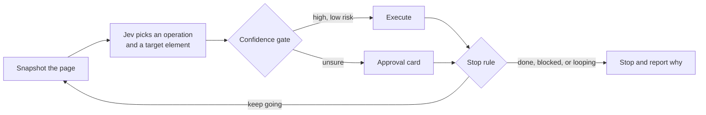

# Jev Gate

A browser agent that lives in a Chrome side panel. A decisions-only model looks
at the page, picks one operation and one element, code performs it, and a
confidence gate decides whether to act on its own or ask a human first.

The idea it is built around is narrow on purpose. Language models are good at
choosing, and unreliable at typing. So the model never touches the page. It
answers a fixed set of multiple-choice questions about what to do next, and
ordinary JavaScript does the clicking.

## Demo

[demo/jev-gate-demo.mp4](demo/jev-gate-demo.mp4) is a real run, not a mockup.
The goal is "open the file panel/voice.js" against this repository's own GitHub
page, and the panel on the right is live.

Three decisions, no retries. It clicks into the `panel` directory at 0.99
confidence, clicks `voice.js` at 0.99, then reports `DONE` at 0.98 with a
verified score of 0.96 and stops itself. The file opens and the run ends without
anyone touching it.

The video is a side-by-side capture of two real browser pages, taken straight
from the renderer, so nothing outside those pages can appear in it.

## The loop



Every cycle is one of four operations. `CLICK` a control, `TYPE_TEXT` into a
field, `SELECT` an option, or declare `DONE`. There is also `BLOCKED`, for when
the page offers nothing that advances the goal.

The model is asked for more than one thing at a time. It reports which
operation to take, how confident it is, which element to act on, how risky that
looks, and whether the goal already appears to be achieved. One request per
step, and every answer is a choice or a score. It never emits free text.

## Why a gate

A model that is 60 percent sure should not be clicking buttons in a live
account. So each decision carries a confidence and a risk score, and the gate
routes it:

- high confidence and low risk runs immediately
- anything uncertain stops at an approval card that shows the proposed target,
  the competing alternatives, and how sure the model was
- a `DONE` claim is only accepted when the model also rates the goal as
  achieved on the page

The loop also has to know when to give up. It stops on a verified `DONE`, on
`BLOCKED`, on two identical actions in a row, on two failed executions, or at a
step cap. That last set of rules exists because the early build clicked the same
element five times in a row on GitHub and never noticed.

## Voice

The panel can be driven by voice. Say a wake word, speak the goal, and the same
loop runs.

```
"hey jev"  →  wake, panel arms
"open the first email"  →  speech to text, goal set, loop runs
```

Two speech systems are used, because one is not enough. Chrome's own recogniser
is used for the wake word, since it streams continuously and costs nothing.
The spoken goal is recorded and sent to Whisper for transcription, because
Chrome's transcript of a full sentence is often wrong and cannot be revisited.
The wake word is stripped before the goal is used, a captured goal shorter than
three letters is refused rather than acted on, and silence of two seconds ends
the sentence.

Listening can also run with the panel closed, through an offscreen document.
That is the only way to keep a microphone open when no panel is on screen.

## Models

Three models do three different jobs, and keeping them apart is most of the
design.

The **decisions model** is Jev, reached through OpenRouter's decisions endpoint.
It only ever answers fixed questions, so it cannot invent an action.

The **text model** writes the value for a `TYPE_TEXT` step, because Jev cannot
emit a string at all. It runs on Groq by default with `qwen/qwen3.8-27b`, which
was measured answering in about 11 milliseconds with a clean value and no
reasoning overhead. OpenRouter remains selectable. A reasoning model is a poor
fit here: `openai/gpt-oss-20b` spends its whole output budget thinking and
returns an empty value, so the panel reports that plainly instead of typing
nothing.

The **speech model** is Groq Whisper, transcribing the recorded goal.

## Install

1. Open `chrome://extensions`, turn on Developer mode, and choose
   **Load unpacked**. Point it at this folder.
2. Open the side panel and paste an OpenRouter key. Jev runs through the
   decisions endpoint at `~typesafe/jev-latest`.
3. Optionally paste a Groq key. It powers both the text model, which writes
   values into fields, and Whisper, which transcribes spoken goals. With it,
   the OpenRouter key is needed only for the decisions model.
4. Type a goal, press **Step once** to watch a single decision, or **Auto** to
   let it run.

Keys are stored in `chrome.storage.local` on your machine. They are never
written into the source, and this repository contains no credentials.

Two notes on the voice controls. A wake word cannot open the side panel itself,
because Chrome only allows that from a real user gesture, so a spoken wake word
opens the agent as a popup window instead and `Ctrl+Shift+J` is provided for
summoning the panel by hand. The microphone is also a site permission rather
than an extension permission, so it is granted to the extension's own origin
under Chrome's site settings, not on the extension details page.

## What works

The loop has been run end to end on real pages. On the `jev-ultrafast`
repository it opened a file in three steps, and on a search page it typed a
query, pressed the button, and stopped itself when the result text appeared.

The gate, the stop rules, and the wake word machine are covered by direct
tests. The wake word machine is deliberately pure code with no microphone
attached, so the transcript handling can be tested on its own, including split
words, repeated wake words, restarted recogniser sessions, and the same command
arriving twice.

Speech to text is verified against the live API with real audio. A spoken
phrase is synthesised, converted to the same Opus stream a browser recorder
produces, and transcribed back through the extension's own code path.

## What is not proven yet

Being specific about this matters more than looking finished.

Real microphone capture has not been tested end to end, because the machine
used to build this has no microphone and no speech service. Everything above
the audio layer is tested, and the audio layer itself is not.

Whether Chrome's speech recognition is willing to run inside an offscreen
document is unknown. The offscreen API permits microphone access, but it says
nothing about the speech API, so the always-on listener may report that it
cannot start. The panel's own listening path works independently of it.

The popup window fallback is what a spoken wake word will realistically
produce. Whether `chrome.sidePanel.open()` ever succeeds outside a gesture has
not been confirmed on a real installation.

## What is being built

The next pieces come from reading how `browser-use/jev-ultrafast` does its work
and looking for what is missing.

- **Verification inside the decision request.** Asking for the next action and a
  check on the previous one in a single call, instead of paying for a second
  round trip.
- **Page section pruning.** Long pages push useful controls past the element
  cap. Scoring sections and sending only the relevant ones should cut cost and
  improve the choice, which is what rtrvr found when it measured the same
  problem.
- **Session memory.** Remembering which element won for a given goal and
  accessibility label on a given site, so repeated runs start from a prior.
- **Shadow DOM and iframes.** Snapshots currently miss controls inside both,
  which is a large share of modern sites.
- **Wake word without the cloud.** Chrome's recogniser sends audio to Google.
  A small local detector would keep the always-on path on the machine.

## Files

```
manifest.json         MV3 manifest, side panel, offscreen, shortcut
background.js         service worker: decisions, transcription, wake coordination
content/snapshot.js   page snapshot and action execution
panel/jev.js          decision questions, gate, stop rules        (pure)
panel/voice.js        wake word machine and speech controller     (pure core)
panel/panel.js        side panel UI and the run loop
offscreen.js          always-on wake listener
sidepanel.html        panel markup and styling
```

## Credit

The decision model is Jev from TypeSafe, reached through OpenRouter's decisions
endpoint. The split between a model that decides and a small model that only
writes field values follows `browser-use/jev-ultrafast`, which is where this
design was learned. The confidence gate, the stop rules, the snapshot layer, and
the voice front end are this project's own, and none of the upstream projects
listed here were written by this project's author.

Speech to text is Groq Whisper, and the text model runs on Groq by default.
Speech synthesis in the panel uses the browser's own engine.
